# Vehicle Detection Project 

The goals / steps of this project are the following:

* Perform a Histogram of Oriented Gradients (HOG) feature extraction on a labeled training set of images and train a classifier Linear SVM classifier
* Optionally, you can also apply a color transform and append binned color features, as well as histograms of color, to your HOG feature vector. 
* Note: for those first two steps don't forget to normalize your features and randomize a selection for training and testing.
* Implement a sliding-window technique and use your trained classifier to search for vehicles in images.
* Run your pipeline on a video stream (start with the test_video.mp4 and later implement on full project_video.mp4) and create a heat map of recurring detections frame by frame to reject outliers and follow detected vehicles.
* Estimate a bounding box for vehicles detected.

[//]: # (Image References)
[image1]: ./examples/car_not_car.png
[image2]: ./examples/HOG_example.jpg
[image3]: ./examples/sliding_windows.jpg
[image4]: ./examples/sliding_window.jpg
[image5]: ./examples/bboxes_and_heat.png
[image6]: ./examples/labels_map.png
[image7]: ./examples/output_bboxes.png
[video1]: ./project_video.mp4

## [Rubric](https://review.udacity.com/#!/rubrics/513/view) Points

In this writeup I will consider the rubric points individually and describe how I addressed each point in my implementation.  

The implementation can be found in the Jupyter notebook `carnd-vehicle-detection.ipynb`. To run it, change to the base folder which contains the `carnd-vehicle-detection.ipynb`. Then run:

```
> conda env create -f environment.yml
> source activate carnd-vehicle-detection
> jupyter notebook carnd-vehicle-detection.ipynb
```

## Histogram of Oriented Gradients (HOG)

_Answering rubric points:_ 
* _Explain how (and identify where in your code) you extracted HOG features from the training images. Explain how you settled on your final choice of HOG parameters._
* _Describe how (and identify where in your code) you trained a classifier using your selected HOG features (and color features if you used them)._

Before considering HOG features I had a look at the color spaces. In the course the HOG is based on the grayscale image, but there could be potentially a more suitable color space for that. Based on discussions in our forums I compared RGB and YCrCB:

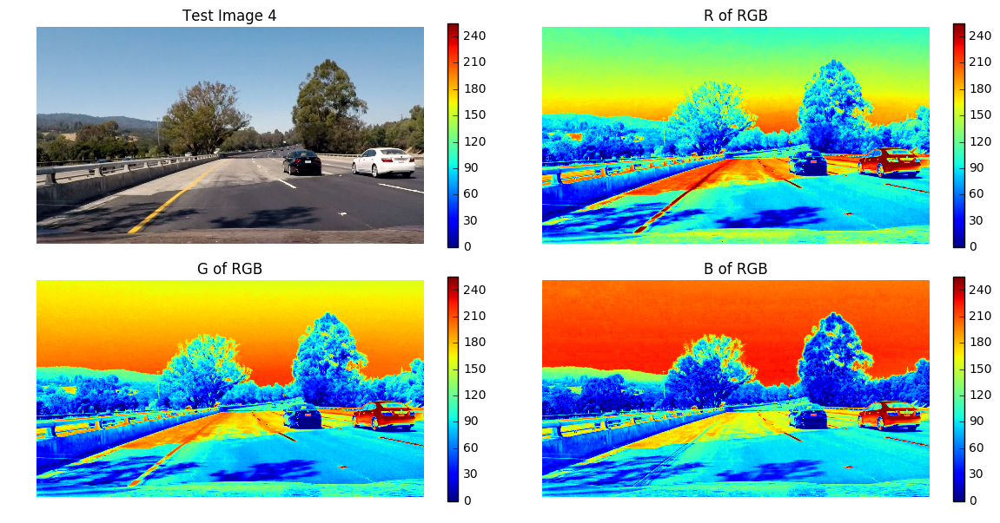

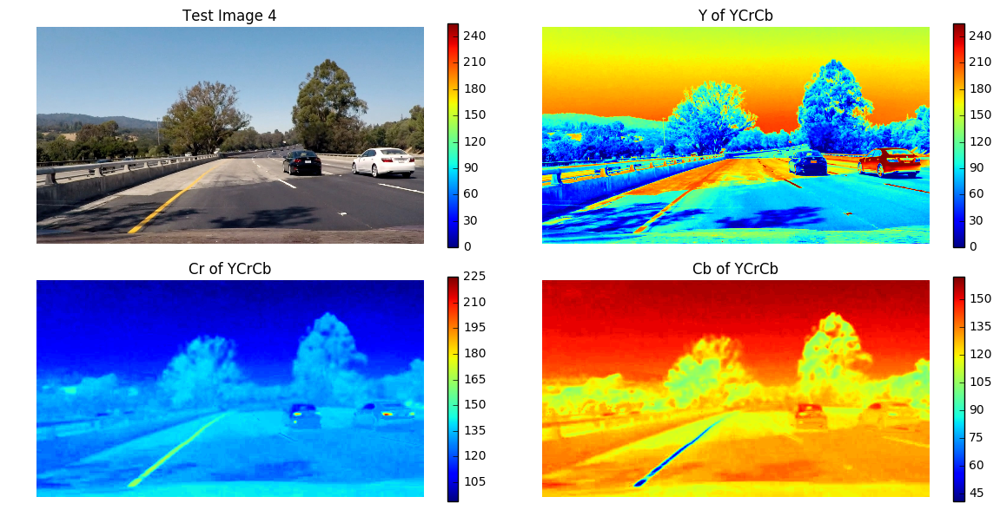

For RGB the information in the individual channels seems to be redundant, especially when looking at the cars and the close area around them. For YCrCB there is more difference between the individual channels. Although the Cr and Cb channel do not seem to be very helpful I calculated the HOG for every channel and included all in my final feature vector as this still improved accuracy slightly (less than 4%).

The function `get_hog_features`  extracts the hog features of a single-channel. It is delegating to the `hog()` function of [scikit-image](http://scikit-image.org/docs/dev/api/skimage.feature.html?highlight=feature%20hog#skimage.feature.hog) which does the actual work. I have chosen the same parameters as presented in the lecture which are a common choice.

| Parameter | Description | Value |
| --------- | ----------- | ----- |
| orientations | number of orientation bins | 9 |
| pixel_per_cell | size (in pixels) of a cell | (8,8) |
| cell_per_block | number of cells in each block | (2,2) |

The image below visualizes the HOG feature calculated per channel. As already indicated by the color space analysis the HOG features for the R, G and B channel look fairly similar while there is more variance for Y, Cr and Cb:

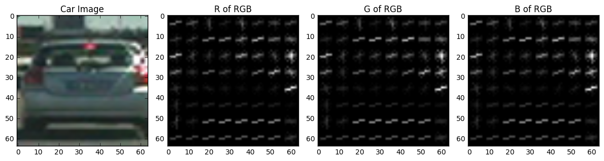

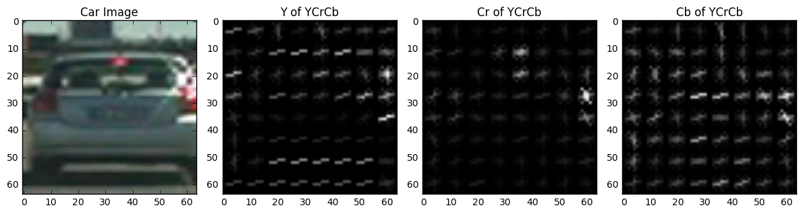

Training the classifier consists of several steps:

#### Choosing features

In the end I decided for the following features:
* HOG feature for th Y, Cr and Cb channel with 9 orientations, 8 pixels per cell and 2 cells per block
* spatial binning with a spatial size of (32,32)
* color histogram with 32 bins

In code this looks like:

```
def extractFeatures(fname):
    image_BGR = cv2.imread(fname)
    image_YCrCb = cv2.cvtColor(image_BGR, cv2.COLOR_BGR2YCrCb)
    
    ch1 = image_YCrCb[:,:,0]
    ch2 = image_YCrCb[:,:,1]
    ch3 = image_YCrCb[:,:,2]
    
    hog1 = get_hog_features(ch1, HOG_ORIENT, HOG_PIX_PER_CELL, HOG_CELL_PER_BLOCK, feature_vec=False).ravel() 
    hog2 = get_hog_features(ch2, HOG_ORIENT, HOG_PIX_PER_CELL, HOG_CELL_PER_BLOCK, feature_vec=False).ravel() 
    hog3 = get_hog_features(ch3, HOG_ORIENT, HOG_PIX_PER_CELL, HOG_CELL_PER_BLOCK, feature_vec=False).ravel() 
    hog_features = np.hstack((hog1, hog2, hog3))
    
    spatial_features = bin_spatial(image_YCrCb, size=SPATIAL_SIZE)

    hist_features = color_hist(image_YCrCb, nbins=HIST_BINS)
  
    features = np.hstack((spatial_features, hist_features, hog_features)).ravel()
    
    return features
```

#### Data preparation

The dataset is already pretty balanced with 8792 car images and 8968 non-car images. The other relevant preparation steps happen in the function `prepare_data()` which
* extracts the feature vector for every image
* normalizes across all features using `sklearn.preprocessing.StandardScaler`
* creates the corresponding labels. A car image is assigned the label 1, a non-car image is assigned the label 2

```
def prepareData():

    # Read all the images with car
    images_with_car_fname = []
    subfolders = glob.glob('vehicles/*')
    for folder in subfolders:
        images_with_car_fname += glob.glob(folder + '/*.png')            
    # Read all the images without car
    images_without_car_fname = []
    subfolders = glob.glob('non-vehicles/*')
    for folder in subfolders:
        images_without_car_fname += glob.glob(folder + '/*.png') 
    
    t1=time.time()
    car_features = []
    for fname in images_with_car_fname:
        car_features.append(extractFeatures(fname))
        
    non_car_features = []
    for fname in images_without_car_fname:
        non_car_features.append(extractFeatures(fname))
    t2=time.time()
    
    # define the labels vector, ordering is cars then non-cars
    labels = np.hstack((np.ones(len(car_features)), np.zeros(len(non_car_features))))
    
    # stack the features together in the same order as the labels
    # transform to np.float64 which is required by StandardScaler
    features = np.vstack((car_features, non_car_features)).astype(np.float64)
    
    # normalize the features
    scaler = StandardScaler().fit(features)
    features = scaler.transform(features)
                      
    print(round(t2-t1, 2), ' seconds to extract features...')
    print("# images with car = ", len(images_with_car_fname))
    print("# images without car = ", len(images_without_car_fname))
    print("feature vector length = ", len(car_features[0]))
    print("# labels = ", len(labels))
    print("# features = ", len(features))
    
    return features, labels, scaler
```

which will print when called:

```
109.62  seconds to extract features...
# images with car =  8792
# images without car =  8968
feature vector length =  8460
# labels =  17760
# features =  17760
```

Finally I have to train the classifier which is straight-forward including 
* shuffling the data to avoid problems due to ordering of the data
* splitting the data into a training and testing set.

```
def train(X, y):
    X, y = shuffle(X, y)
    X_train, X_test, y_train, y_test = train_test_split(
        X, y, test_size=0.2, random_state=42)
    
    clf = LinearSVC(max_iter=20000)
    clf.fit(X_train, y_train)
    print("Accuracy on test set: ", clf.score(X_test, y_test))
    return clf

clf = train(features, labels)
```
and yields an accuracy of 0.993 on the test set.

## Sliding Window Search

_Answering rubric points:_ 
* _Describe how (and identify where in your code) you implemented a sliding window search. How did you decide what scales to search and how much to overlap windows?_
* _Show some examples of test images to demonstrate how your pipeline is working. How did you optimize the performance of your classifier?_

In order to implement sliding window search I reused the `slide_window` and `draw_boxes` function from the course.
I did not slide windows across the whole image, but only after the region of interest (which I made dependent on the scale).

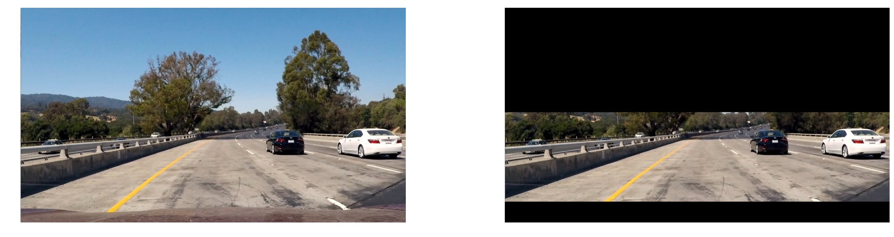

The following lines slide (with zero overlap) a window with a size of (128, 128) over the region of interest and then draw the windows on the image:

```
windows = slide_window(image_RGB_roi, x_start_stop=[0, w], y_start_stop=[350, 670], 
                    xy_window=(128, 128), xy_overlap=(0, 0))
                       
image_RGB_roi = draw_boxes(image_RGB_roi, windows, color=(0, 0, 255), thick=6) 
```

The result of this is 

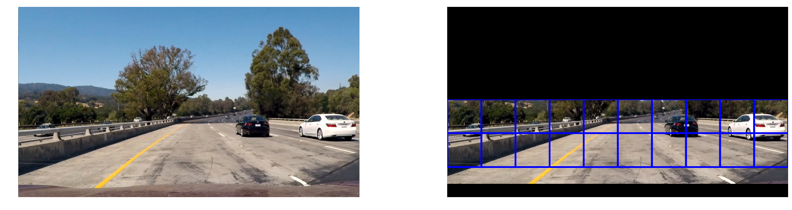

The final approach taken on the sliding window search is slightly different from an implementation perspective and based on the section *Hog Sub-sampling Window Search* from the lecture. Instead of using an overlap we define how many cells we move to the right and to the bottom for getting the next window. 
Once we have the window position, we extract the HOG features for, spatial binning and color histogram for the patch. This is combined in a feature vector and fed to the classifier. In case of a car prediction we create a bounding box and it to the result list.

```
# Define a single function that can extract features using hog sub-sampling and make predictions
def find_cars(image_RGB, ystart, ystop, scale, svc, scaler):
    
    box_list = []

    img_tosearch = image_RGB[ystart:ystop,:,:]
    ctrans_tosearch = convert_color(img_tosearch, conv='RGB2YCrCb')
    if scale != 1:
        imshape = ctrans_tosearch.shape
        # if the scale is > 1, meaning the windows are bigger, 
        # then this can be simulated by making, the image smaller but leaving the window as is.
        ctrans_tosearch = cv2.resize(ctrans_tosearch, (np.int(imshape[1]/scale), np.int(imshape[0]/scale)))

    # Define blocks and steps as above
    nxblocks = (ch1.shape[1] // pix_per_cell)-1
    nyblocks = (ch1.shape[0] // pix_per_cell)-1 
    nfeat_per_block = orient*cell_per_block**2
    
    # 64 was the orginal sampling rate, with 8 cells and 8 pix per cell
    window = 64
    nblocks_per_window = (window // pix_per_cell)-1 
    cells_per_step = 2  # Instead of overlap, define how many cells to step
    nxsteps = (nxblocks - nblocks_per_window) // cells_per_step
    nysteps = (nyblocks - nblocks_per_window) // cells_per_step
    
    # Compute individual channel HOG features for the entire image
    ch1 = ctrans_tosearch[:,:,0]
    ch2 = ctrans_tosearch[:,:,1]
    ch3 = ctrans_tosearch[:,:,2]
    hog1 = get_hog_features(ch1, HOG_ORIENT, HOG_PIX_PER_CELL, HOG_CELL_PER_BLOCK, feature_vec=False)
    hog2 = get_hog_features(ch2, HOG_ORIENT, HOG_PIX_PER_CELL, HOG_CELL_PER_BLOCK, feature_vec=False)
    hog3 = get_hog_features(ch3, HOG_ORIENT, HOG_PIX_PER_CELL, HOG_CELL_PER_BLOCK, feature_vec=False)
    
    for xb in range(nxsteps):
        for yb in range(nysteps):
            ypos = yb*cells_per_step
            xpos = xb*cells_per_step
            
            # Extract HOG for this patch
            hog_feat1 = hog1[ypos:ypos+nblocks_per_window, xpos:xpos+nblocks_per_window].ravel() 
            hog_feat2 = hog2[ypos:ypos+nblocks_per_window, xpos:xpos+nblocks_per_window].ravel() 
            hog_feat3 = hog3[ypos:ypos+nblocks_per_window, xpos:xpos+nblocks_per_window].ravel() 
            hog_features = np.hstack((hog_feat1, hog_feat2, hog_feat3))
            xleft = xpos*HOG_PIX_PER_CELL
            ytop = ypos*HOG_PIX_PER_CELL
            
            # Extract the image patch
            subimg = ctrans_tosearch[ytop:ytop+window, xleft:xleft+window]
            spatial_features = bin_spatial(subimg, size=SPATIAL_SIZE)
            hist_features = color_hist(subimg, nbins=HIST_BINS)
            
            feature_list = np.hstack((spatial_features, hist_features, hog_features))

            # Make a prediction on the patch
            test_features = scaler.transform(feature_list.reshape(1,-1))       
            test_prediction = svc.predict(test_features)
            
            if test_prediction == 1:
                
                xbox_left = np.int(xleft*scale)
                ytop_draw = np.int(ytop*scale)
                win_draw = np.int(window*scale)
                
                box_list.append(((xbox_left, ytop_draw+ystart), (xbox_left+win_draw,ytop_draw+win_draw+ystart)))
                
    return box_list
```
When running the `find_cars` function on `test4.jpg` (with a scale of 1.5, ystart of 350 and ystop of 670) the result is:
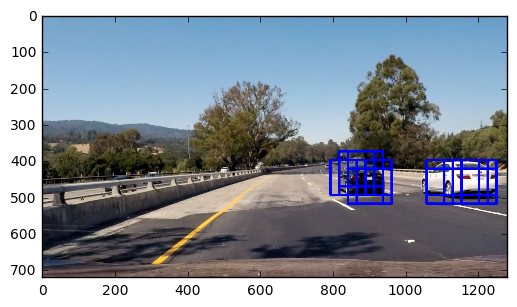

Given the bounding boxes identified by `find_cars` we can create a heatmap. With this we can only consider pixels to belong to a car if we have a certain number of votes for a pixel and the pipeline gets more robust. The heatmap is created using the method `create_heatmap` which simply counts the *votes* and then applies a threshold:

```
def create_heatmap(self, image_BGR, bbox_list):
   heat = np.zeros_like(image_BGR[:,:,0]).astype(np.float)

    for box in bbox_list:
        #print(box)
        # Add += 1 for all pixels inside each bbox
        # Assuming each "box" takes the form ((x1, y1), (x2, y2))
        heat[box[0][1]:box[1][1], box[0][0]:box[1][0]] += 1
        
    heat = self._apply_threshold(heat)
    heat = np.clip(heat, 0, 255)
    return heat
```

The visualization below shows four images per row:
* the first image is an original test image
* the second image shows the bounding boxes of patches classified as car images. Note that this is one particular scale (1.5) and one particular region of interest (pixels where the y value is between 350 and 670)
* the third image shows only the heatmap, created by the method `create_heatmap`
* the fourth image shows bounding boxes derived from the heatmap using `scipy.ndimage.measurements.label`.

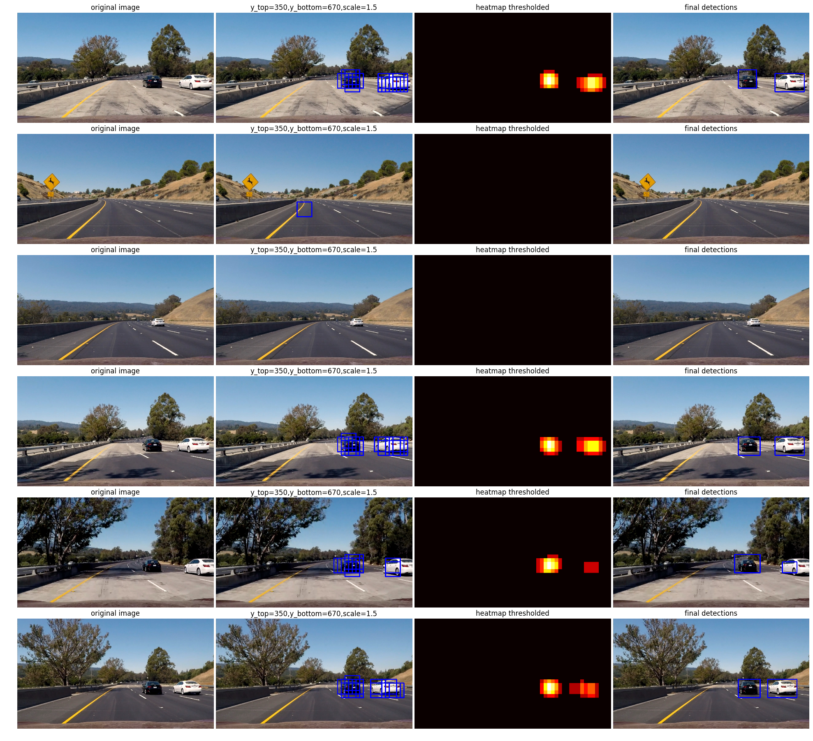

In row 2 there is one false positive and in row 3 there is one positive, however because no pixel gets enough votes (belonging to a patch classified as car) the pipeline predicts that there is no car in the image. To further improve I played around with different scales and region of interests

| Scale | Y top | Y bottom | 
| ---- | ------ | -------- |
| 1 | 350 | 550 | 
| 1.2 | 380 | 550 |
| 1.5 | 400 | 550 |
| 1.8 | 400 | 600 |

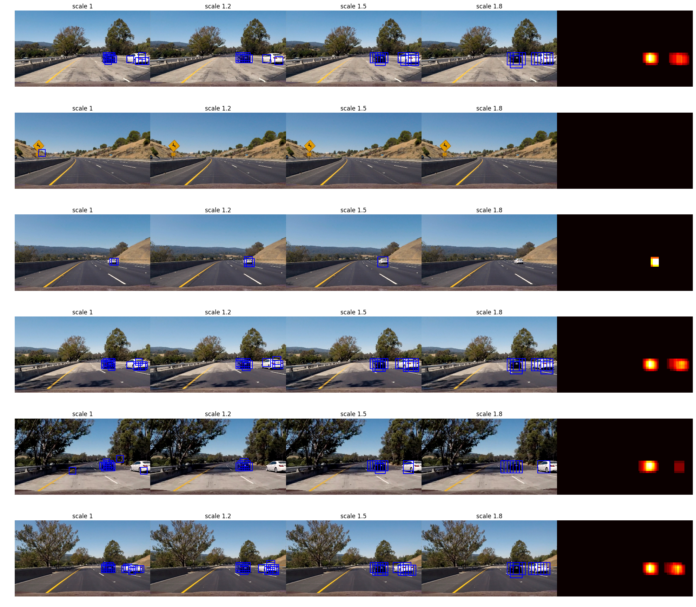

The number of detections per scale is given in the table below

|| Scale 1.0 | Scale 1.2 | Scale 1.5 | Scale 1.8 |
|---|---|---|---|---|
| Image 1  | 18  | 11  |  11 | 8  |
| Image 2   | 1  | 0  | 0  |  0 |
| Image 3   | 2  | 3  |  1 | 0  |
| Image 4   | 19  | 14  | 14  | 9  |
| Image 5   | 17  |  9 |  8 |  5 |
| Image 6   | 20  | 17  | 13  | 8  |

Because there are quite some false positives with scale 1.0 and scale 1.0 is the most compute-intensive scale I decided to use only the scales 1.2, 1.5 and 1.8 in my final pipeline.

```
def image_pipeline(image_RGB):
    
    image_BGR = cv2.cvtColor(image_RGB, cv2.COLOR_RGB2BGR)
    
    ystart = 380
    ystop = 550
    box_list_1 = find_cars(image_BGR, ystart, ystop, 1.2, svc, scaler)
   
    ystart = 400
    ystop = 550
    box_list_2 = find_cars(image_BGR, ystart, ystop, 1.5, svc, scaler)
    
    ystart = 400
    ystop = 600
    box_list_3 = find_cars(image_BGR, ystart, ystop, 1.8, svc, scaler)
    
    all_boxes = box_list_1 + box_list_2 + box_list_3
    h = Heatmap()
    heat = h.createHeatmap(image_BGR, all_boxes)
    labels = h.getBoundingBoxes(heat)
    output = draw_boxes(np.copy(image_RGB), labels)
    
    return output
```

Running the pipeline on a single image like 

```
img_BGR = mpimg.imread('./test_images/test4.jpg')
output = image_pipeline(image_RGB)
plt.imshow(output)
plt.axis('off')
plt.show()
```
will result in the image

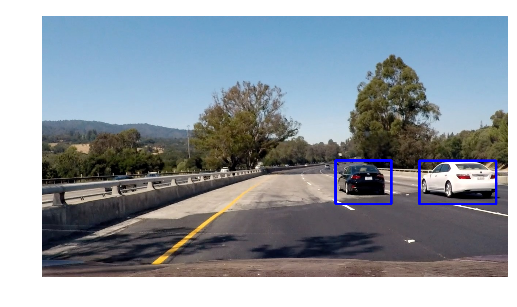

## Video Implementation

_Answering rubric points:_ 
* _Provide a link to your final video output. Your pipeline should perform reasonably well on the entire project video (somewhat wobbly or unstable bounding boxes are ok as long as you are identifying the vehicles most of the time with minimal false positives.)_
* _Describe how (and identify where in your code) you implemented some kind of filter for false positives and some method for combining overlapping bounding boxes._

In the first version I process each frame individually without considering what happend in the frame before. The [project_video_single_frame.mp4](./project_video_single_frame.mp4) is quite okay but somewhat wobbly.
Avoiding false positives has been already covered in the sections above. In addition to thresholding of the heatmap for a particular image I created a version which is aware of what happend in the previous frames:

```
# initalization of the deque
d = deque([], maxlen=4) 
# running with a slightly different version of the image pipeline
clip = clip.fl_image(image_pipeline_context_aware)
```

```
def image_pipeline_context_aware(image_RGB):
 
    # some lines skipped
    all_boxes = box_list_1 + box_list_2 + box_list_3

    # remember the bounding boxes for all three scales (1.2, 1.5, 1.8) 
    d.append(all_boxes)
    # create a flat list which contains the bounding boxes for the
    # current and previous 4 (maxlen of deque) frames
    result = []
    for lst in d:
        result.extend(lst[:])
       
    # choose a higher value for thresholding as there are more 
    # votes per pixel now since we are passing result instead 
    # of all_boxes to createHeatmap
    h = Heatmap(5)
    heat = h.createHeatmap(image_RGB, result)
```

In the visualization the heatmap looks smoother when considering the previous four frames.

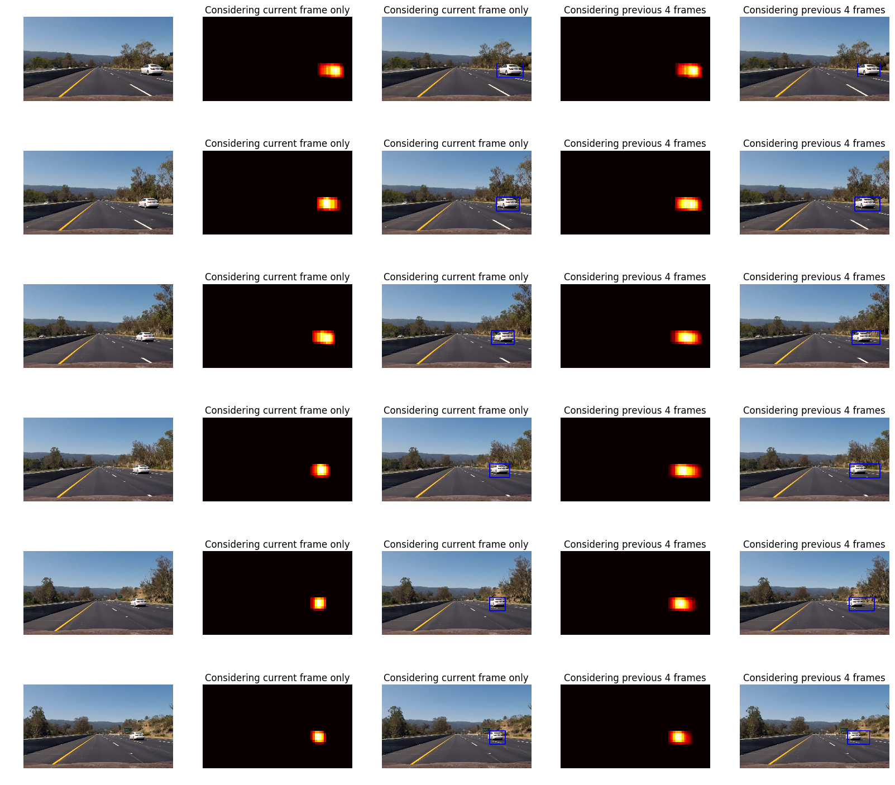

The [project_video_four_frames.mp4](./project_video_four_frames.mp4) is less wobbly, at least it appeaers so to me 😄. 

## Discussion 

_Answering rubric points:_ 
* _Briefly discuss any problems / issues you faced in your implementation of this project. Where will your pipeline likely fail? What could you do to make it more robust?_

The major challenge was the sliding window search. The classifier itself and the feature extraction is pretty straight-forward. The trick with scaling the underlying image instead of scaling the window is very cool, but it took me some time to understand how it works. When using the pipeline which takes into consideration the previous four frames it takes longer to recognize new cars in the image compared to the pipeline which does not do this. I believe that there could be lot of improvements how to leverage the information from the previous frames than just adding them to the list of detections. For example the height and width of the bounding box could be used so that there is a smoother and lower change in bounding box size from one frame to the other. Predicting the next position of another car based on the bounding boxes calculated so far could be another idea to make it more robust.
Another thing is that the sliding window search is quite compute-intensive which would be a challenge in a real-world scenario.
