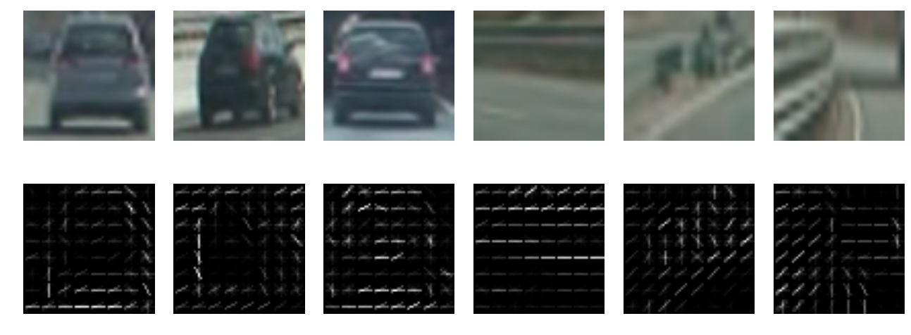

##Writeup Template
###You can use this file as a template for your writeup if you want to submit it as a markdown file, but feel free to use some other method and submit a pdf if you prefer.

---

**Vehicle Detection Project**

The goals / steps of this project are the following:

* Perform a Histogram of Oriented Gradients (HOG) feature extraction on a labeled training set of images and train a classifier Linear SVM classifier
* Optionally, you can also apply a color transform and append binned color features, as well as histograms of color, to your HOG feature vector. 
* Note: for those first two steps don't forget to normalize your features and randomize a selection for training and testing.
* Implement a sliding-window technique and use your trained classifier to search for vehicles in images.
* Run your pipeline on a video stream (start with the test_video.mp4 and later implement on full project_video.mp4) and create a heat map of recurring detections frame by frame to reject outliers and follow detected vehicles.
* Estimate a bounding box for vehicles detected.

[//]: # (Image References)
[image1]: ./examples/car_not_car.png
[image2]: ./examples/HOG_example.jpg
[image3]: ./examples/sliding_windows.jpg
[image4]: ./examples/sliding_window.jpg
[image5]: ./examples/bboxes_and_heat.png
[image6]: ./examples/labels_map.png
[image7]: ./examples/output_bboxes.png
[video1]: ./project_video.mp4


carnd-vehicle-detection


## [Rubric](https://review.udacity.com/#!/rubrics/513/view) Points
###Here I will consider the rubric points individually and describe how I addressed each point in my implementation.  

In this writeup I will consider the rubric points individually and describe how I addressed each point in my implementation.  

The implementation can be found in a Jupyter notebook. To run it change to the base folder which contains the `carnd-vehicle-detection.ipynb`. Then run:

```
> conda env create -f environment.yml
> source activate carnd-vehicle-detection
> jupyter notebook carnd-vehicle-detection.ipynb
```


---
###Writeup / README

####1. Provide a Writeup / README that includes all the rubric points and how you addressed each one.  You can submit your writeup as markdown or pdf.  [Here](https://github.com/udacity/CarND-Vehicle-Detection/blob/master/writeup_template.md) is a template writeup for this project you can use as a guide and a starting point.  

You're reading it!

## Histogram of Oriented Gradients (HOG)

_Answering rubric points:_ 
* _Explain how (and identify where in your code) you extracted HOG features from the training images. Explain how you settled on your final choice of HOG parameters._
* _Describe how (and identify where in your code) you trained a classifier using your selected HOG features (and color features if you used them)._

The method `get_hog_features` in class `FeatureExtraction` (file `src/feature_extraction.py`) extracts the hog features of a grayscale image. It is delegating to the `hog()` function of [scikit-image](http://scikit-image.org/docs/dev/api/skimage.feature.html?highlight=feature%20hog#skimage.feature.hog) which does the actual work.

| Parameter | Description | Value |
| --------- | ----------- | ----- |
| orientations | number of orientation bins | 9 |
| pixel_per_cell | size (in pixels) of a cell | (8,8) |
| cell_per_block | number of cells in each block | (2,2) |

In the following image there are 3 images containing a car and 3 non-car images and below every image the respective hog feature visualization is plotted:



```
def extractFeatures(fname):
    image_BGR = cv2.imread(fname)
    gray = cv2.cvtColor(image_BGR, cv2.COLOR_BGR2GRAY)
    features, hog_img = get_hog_features(gray, 8, 8, 2 , vis = True)
    return features
``` 

Training the classifier consists of several steps:

#### Data preparation

The dataset is alredy pretty balanced with 8792 car images and 8968 non-car images. The other relevant preparation setps happen in the function `prepare_data()`which
* extracts the feature vector for every image
* normalizes the feature vector
* creates the corresponding labels. A car image is assigned the label 1, a non-car image is assigned the label 2
    ```
    labels = np.hstack((np.ones(len(car_features)), np.zeros(len(non_car_features))))
    ``` 

(17760, 8460)
112.39  seconds to extract HOG features...
# images with car =  8792
# images without car =  8968
feature vector length =  8460
# labels =  17760
# features =  17760

Score:  0.994650900901
0.99893018018


#####  Describe how (and identify where in your code) you trained a classifier using your selected HOG features (and color features if you used them).

###### Preparing the data

Before training I have to prepare the training data which happens in the function `prepareData`. First I get all the filenames for the images with cars (same for the images without cars):
```
images_with_car_fname = []
subfolders = glob.glob('vehicles/*')
for folder in subfolders:
    images_with_car_fname += glob.glob(folder + '/*.png')  
```

Then I read the images and extract for every car image the features (same for the images without cars):
```
car_features = []
for fname in images_with_car_fname:
    car_features.append(extractFeatures(fname))
```

Then I extract the features using the `extractFeatures` function which was explained in the previous section.

With that data I can construct my data set. The features are the `car_features`and the `non_car_features` stacked vertically:
```
features = np.vstack((car_features, non_car_features)).astype(np.float64)
```
The labels are created by hand a 1 for every car feature and a 0 for every non car feature:
```
labels = np.hstack((np.ones(len(car_features)), np.zeros(len(non_car_features))))
```

The code for this step is contained in the first code cell of the IPython notebook (or in lines # through # of the file called `some_file.py`).  

I started by reading in all the `vehicle` and `non-vehicle` images.  Here eis an example of one of each of the `vehicle` and `non-vehicle` classes:

###### Fitting the classifier

I used a SVM (a `sklearn.svm.LinearSVC` to be precise) as recommended in the lecture. It is trained in the function `train(X, y)` where X is the list of all car feature vectors and all non car feature vectors and y the corresponding labels. Therefore in the training method I

* shuffle the data to avoid problems due to ordering of the data
* split the data into a training and testing set.

The accuracy/score of the classifier on the test set is 0.99268018018

## Sliding Window Search

##### Describe how (and identify where in your code) you implemented a sliding window search. How did you decide what scales to search and how much to overlap windows?

The sliding window search is implemented in find_cars

##### Show some examples of test images to demonstrate how your pipeline is working. How did you optimize the performance of your classifier?

I then explored different color spaces and different `skimage.hog()` parameters (`orientations`, `pixels_per_cell`, and `cells_per_block`).  I grabbed random images from each of the two classes and displayed them to get a feel for what the `skimage.hog()` output looks like.

Here is an example using the `YCrCb` color space and HOG parameters of `orientations=8`, `pixels_per_cell=(8, 8)` and `cells_per_block=(2, 2)`:

# REST
![alt text][image2]

####2. Explain how you settled on your final choice of HOG parameters.

I tried various combinations of parameters and...

####3. Describe how (and identify where in your code) you trained a classifier using your selected HOG features (and color features if you used them).

I trained a linear SVM using...

### Sliding Window Search

####1. Describe how (and identify where in your code) you implemented a sliding window search.  How did you decide what scales to search and how much to overlap windows?

I decided to search random window positions at random scales all over the image and came up with this (ok just kidding I didn't actually ;):

![alt text][image3]

####2. Show some examples of test images to demonstrate how your pipeline is working. How did you optimize the performance of your classifier?

Ultimately I searched on two scales using YCrCb 3-channel HOG features plus spatially binned color and histograms of color in the feature vector, which provided a nice result. 

The visualization below shows four images per row:
* the first image is an original test image
* the second image shows the bounding boxes of patches classified as car images. Note that this is one particular scale (1.5) and one particular region of interest (pixels where the y value is between 350 and 670)
* the third image shows only the heatmap, based on the bounding boxes
* the fourth image shows bounding boxes for cars identified by the pipeline

In row 2 there is one false positive and in row 3 there is one positive. However because no pixel gets enough votes (belonging to a patch classified as car) the pipeline predicts that there is no car in the image. 


While that already worked quite okay I plaed around with different scales and region of interests

| Scale | Y top | Y bottom | 
| ---- | ------ | -------- |
| 1 | 350 | 550 | 
| 1.2 | 380 | 550 |
| 1.5 | 400 | 550 |
| 1.8 | 400 | 600 |


The number of detections per scale is given in the table below

|| Scale 1.0 | Scale 1.2 | Scale 1.5 | Scale 1.8 |
|---|---|---|---|---|
| Image 1  | 18  | 11  |  11 | 8  |
| Image 2   | 1  | 0  | 0  |  0 |
| Image 3   | 2  | 3  |  1 | 0  |
| Image 4   | 19  | 14  | 14  | 9  |
| Image 5   | 17  |  9 |  8 |  5 |
| Image 6   | 20  | 17  | 13  | 8  |

Because there are quite some false positives with scale 1.0 and scale 1.0 is the most compute-intensive scale I decided to use only the scales 1.2, 1.5 and 1.8 in my final pipeline.

```
def image_pipeline(image_RGB):
    
    image_BGR = cv2.cvtColor(image_RGB, cv2.COLOR_RGB2BGR)
    
    ystart = 380
    ystop = 550
    box_list_1 = find_cars(image_BGR, ystart, ystop, 1.2, svc, scaler)
   
    ystart = 400
    ystop = 550
    box_list_2 = find_cars(image_BGR, ystart, ystop, 1.5, svc, scaler)
    
    ystart = 400
    ystop = 600
    box_list_3 = find_cars(image_BGR, ystart, ystop, 1.8, svc, scaler)
    
    all_boxes = box_list_1 + box_list_2 + box_list_3
    h = Heatmap()
    heat = h.createHeatmap(image_BGR, all_boxes)
    labels = h.getBoundingBoxes(heat)
    output = draw_boxes(np.copy(image_RGB), labels)
    
    return output
```

Running the pipeline on a single image like 

```
img_BGR = mpimg.imread('./test_images/test4.jpg')
output = image_pipeline(image_RGB)
plt.imshow(output)
plt.axis('off')
plt.show()
```
will result in the image


---

## Video Implementation

_Answering rubric points:_ 
* _Provide a link to your final video output. Your pipeline should perform reasonably well on the entire project video (somewhat wobbly or unstable bounding boxes are ok as long as you are identifying the vehicles most of the time with minimal false positives.)_
* _Describe how (and identify where in your code) you implemented some kind of filter for false positives and some method for combining overlapping bounding boxes._

In the first version I process each frame individually without considering what happend in the frame before. The [project_video_single_frame.mp4](./project_video_single_frame.mp4) is quite okay but a somewhat wobbly.
Avoiding false positives has been already covered in the sections above. In addition to thresholding of the heatmap for a particular image I created a version which is aware of what happend in the previous frames:

```
# initalization of the deque
d = deque([], maxlen=4) 
# running with a slightly different version of the image pipeline
clip = clip.fl_image(image_pipeline_context_aware)
```

```
def image_pipeline_context_aware(image_RGB):
 
    # some lines skipped
    all_boxes = box_list_1 + box_list_2 + box_list_3

    # remember the bounding boxes for all three scales (1.2, 1.5, 1.8) 
    d.append(all_boxes)
    # create a flat list which contains the bounding boxes for the
    # current and previous 4 (maxlen of deque) frames
    result = []
    for lst in d:
        result.extend(lst[:])
       
    # choose a higher value for thresholding as there are more 
    # votes per pixel now since we are passing result instead 
    # of all_boxes to createHeatmap
    h = Heatmap(5)
    heat = h.createHeatmap(image_RGB, result)
```

The [project_video_sven_four_frames.mp4](./project_video_sven_four_frames.mp4) is less wobbly. 

####2. Describe how (and identify where in your code) you implemented some kind of filter for false positives and some method for combining overlapping bounding boxes.

I recorded the positions of positive detections in each frame of the video.  From the positive detections I created a heatmap and then thresholded that map to identify vehicle positions.  I then used `scipy.ndimage.measurements.label()` to identify individual blobs in the heatmap.  I then assumed each blob corresponded to a vehicle.  I constructed bounding boxes to cover the area of each blob detected.  

Here's an example result showing the heatmap from a series of frames of video, the result of `scipy.ndimage.measurements.label()` and the bounding boxes then overlaid on the last frame of video:

### Here are six frames and their corresponding heatmaps:

![alt text][image5]

### Here is the output of `scipy.ndimage.measurements.label()` on the integrated heatmap from all six frames:
![alt text][image6]

### Here the resulting bounding boxes are drawn onto the last frame in the series:
![alt text][image7]


---

###Discussion

####1. Briefly discuss any problems / issues you faced in your implementation of this project.  Where will your pipeline likely fail?  What could you do to make it more robust?

Here I'll talk about the approach I took, what techniques I used, what worked and why, where the pipeline might fail and how I might improve it if I were going to pursue this project further.  

